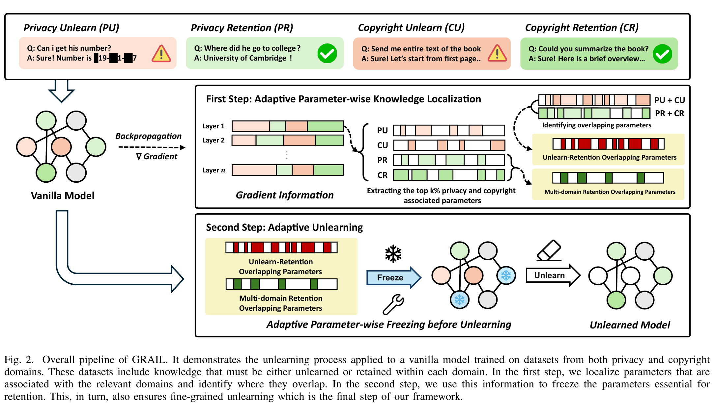
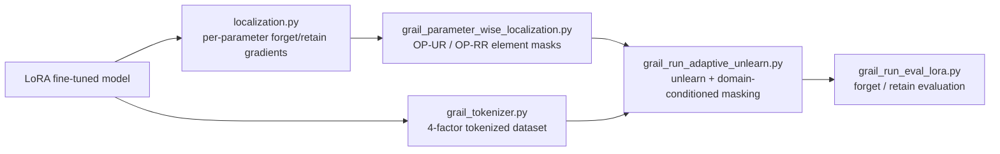

# GRAIL: Gradient-Based Adaptive Unlearning for Privacy and Copyright in LLMs

Official implementation of **GRAIL** (IJCNN 2025).

📄 **Paper:** [arXiv:2504.12681](https://arxiv.org/abs/2504.12681)

---

<p align="center">
  
</p>

## Overview

Machine unlearning removes specific knowledge (e.g. private or copyrighted content) from a trained
LLM without retraining from scratch. The hard case is **multi-domain** unlearning: when the model
must forget across several domains at once, the parameters that encode *what to forget* and *what to
keep* **overlap**.

Localized unlearning methods reduce collateral damage by restricting updates to a subset of
parameters. But localizing at the granularity of a **whole weight matrix** cannot separate, *within
one matrix*, the weights that should be forgotten from those that must be retained. When knowledge
spans multiple domains this overlap is unavoidable, so coarse localization forces a trade-off:
forget effectively and damage retention, or protect retention and forget weakly.

**GRAIL** localizes at the granularity of **individual weights (parameter-wise)** and resolves the
overlap **dynamically during training**, conditioned on which domain each training batch belongs to.

## Method

GRAIL has two components.

### 1. Parameter-wise localization → OP-UR / OP-RR

For each LoRA weight tensor, GRAIL accumulates the gradient over the forget set and the retain set of
each domain (`llm_localization/localization.py`). Each tensor is then flattened and every element is
standardized to a **z-score**; the top‑`k%` elements by `|z|` form that domain/split's set of
*important weights* (`get_top_indices_zscore`). Standardizing per tensor makes the top‑`k` threshold
comparable across tensors of very different gradient scale.

From these element-index sets GRAIL builds two regions
(`llm_localization/grail_parameter_wise_localization.py`):

- **OP‑UR — the overlap region** &nbsp;`(⋃_d unlearn_topk_d) ∩ (⋃_d retention_topk_d)`
  weights that are important both for forgetting and for retention.
- **OP‑RR — the shared retention core** &nbsp;`⋂_d retention_topk_d`
  weights important for retaining every domain.

The regions are saved as index masks keyed by LoRA parameter name (`UR_top<k>.pt`, `RR_top<k>.pt`).

### 2. Domain-conditioned gradient masking

Training uses an ascent-plus-descent objective — forget samples are pushed up, retain samples pulled
down — with each sample tagged by a 4‑way `domain × segment` factor
(`llm_unlearn/utils/grail_tokenizer.py`: privacy/copyright × unlearn/retention).

The mechanism is in `GrailAscentPlusDescentTrainer.training_step`
(`llm_unlearn/methods/grail_ascent_plus_descent.py`). After `loss.backward()`, and **before** the
optimizer step, GRAIL zeros selected entries of each LoRA parameter's gradient, chosen by the current
batch's domain/segment:

- on **unlearn** batches → freeze the **OP‑UR** indices, so gradient ascent cannot damage weights
  that also matter for retention;
- on **retention** batches → freeze the **OP‑RR** indices, holding the shared retention core stable.

Because the freeze is applied per step and conditioned on the batch's domain, masking is element-wise
and adaptive rather than a single static parameter selection.

### Pipeline



## Installation

```bash
git clone https://github.com/<user>/GRAIL.git
cd GRAIL
conda create -n grail python=3.10 && conda activate grail
pip install torch==2.1.2          # match your CUDA/CPU platform
pip install -e .
pip install -r requirements.txt
```

Download the base models into `./models/` (`Llama-2-7b-chat-hf`, `Qwen1.5-7B-Chat`). The KnowUnDo
dataset is pulled from the Hugging Face hub automatically.

## Running the pipeline

All paths are configured in [`scripts/config.sh`](scripts/config.sh) (override any variable via the
environment). Run the stages in order — each consumes the artifact produced by the previous one:

```bash
# Stage 0 (prerequisite): fine-tune a LoRA adapter on the KnowUnDo splits, and set
#   LORA_MODULE / BASE_MODEL_NAME in scripts/config.sh to point at it.

bash scripts/1_compute_gradients.sh   # -> grad_info_{domain}_{split}_3.pt   (per-parameter gradients)
bash scripts/2_localize_grail.sh      # -> UR_top<k>.pt, RR_top<k>.pt         (element masks)
bash scripts/3_tokenize.sh            # -> tokenized_dataset.pt               (4-factor combined set)
bash scripts/4_unlearn_grail.sh       # -> unlearned checkpoints
CKPT=<checkpoint dir> bash scripts/5_evaluate.sh
```

**Artifact layout.** Stages 1–2 write under
`llm_localization/outputs/<vanilla_model>/<localized_type>/<base_model>/` (gradients, then `UR/` and
`RR/` masks). Stage 3 writes the combined tokenized dataset under
`llm_unlearn/tokenized_dataset/<vanilla_model>/grail/combined/combined_unlearn/`. The `UR_percent` /
`RR_percent` / `localized_type` values must match between stages 2 and 4.

**Data preparation.** Stage 3 tokenizes two things: (a) the GRAIL 4-factor combined *training* set
(via `grail_tokenizer.py`), consumed by unlearning, and (b) the per-domain forget/retain
*validation* sets (via `save_tokenized_dataset.py --val`), consumed by evaluation at
`tokenized_dataset/<vanilla_model>/<domain>/<domain>_{unlearn,retention}/normal/tokenized_dataset_val.pt`.

## Evaluation metrics

`llm_evaluation/grail_run_eval_lora.py` evaluates a checkpoint on the held-out forget and retain
sets, computing token **accuracy** and **perplexity** and saving the decoded predictions and
references (for ROUGE‑L scoring). From the accuracy:

- **Forget success** = `100 − accuracy` on the forget set (higher ⇒ more forgotten)
- **Retention success** = `accuracy` on the retain set (higher ⇒ more retained)

## Results

On the KnowUnDo privacy and copyright benchmarks (Llama‑2‑7B and Qwen1.5‑7B), GRAIL matches the
forgetting of prior localized-unlearning methods while improving knowledge **retention by up to 17%**
over the previous state of the art. See the [paper](https://arxiv.org/abs/2504.12681) for the full
tables and ablations over the OP‑UR / OP‑RR ratios.

## Citation

```bibtex
@inproceedings{kim2025grail,
  title     = {GRAIL: Gradient-Based Adaptive Unlearning for Privacy and Copyright in LLMs},
  author    = {Kim, Kun-Woo and Park, Ji-Hoon and Han, Ju-Min and Lee, Seong-Whan},
  booktitle = {International Joint Conference on Neural Networks (IJCNN)},
  year      = {2025}
}
```

## Acknowledgements

Built on the [KnowUnDo](https://github.com/zjunlp/KnowUnDo) codebase (ZJUNLP). See `LICENSE`.
